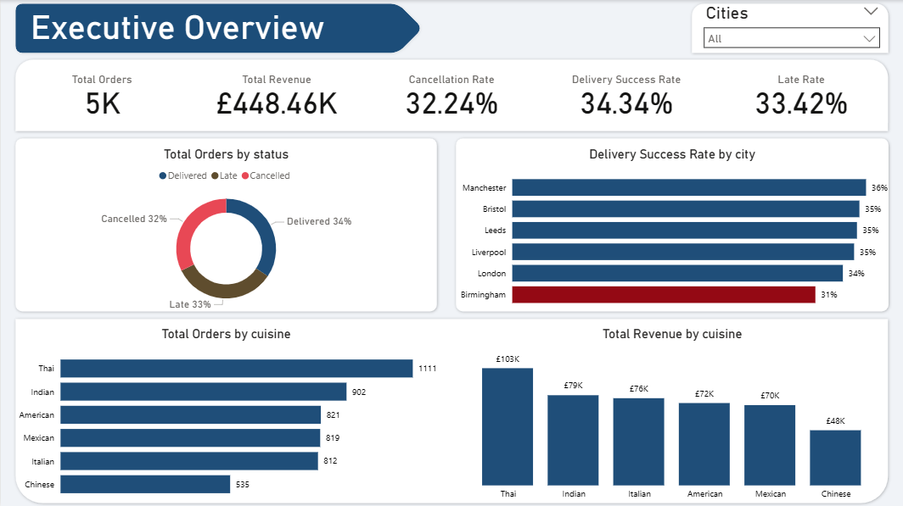
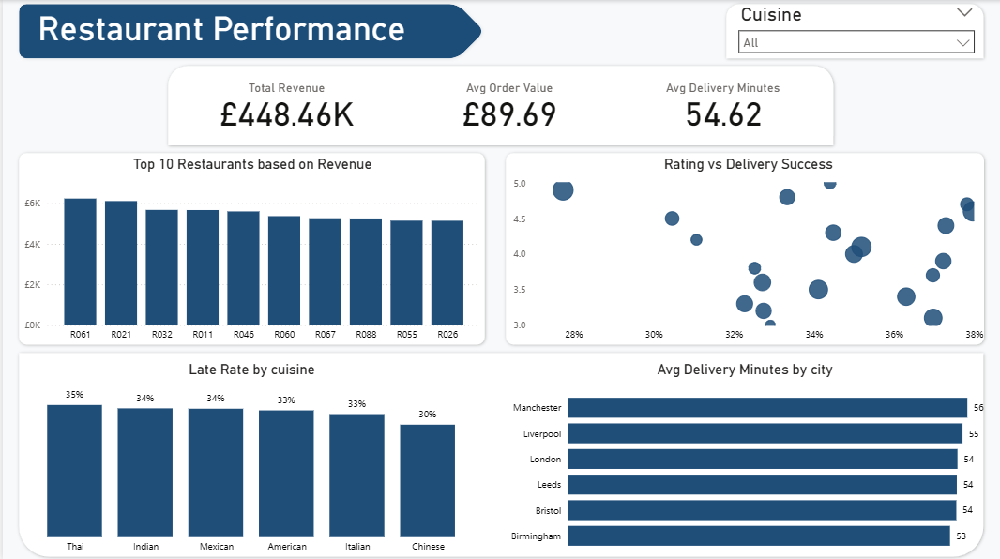
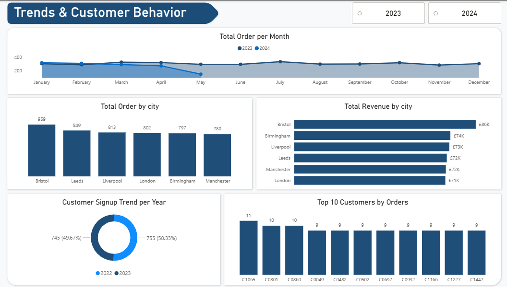

# Food Delivery System Analysis (Power BI Dashboard)

A business intelligence project analysing the operational performance of a food delivery platform across six UK cities, built entirely in Power BI using a five-table relational data model.

---

## Business Question

> _Only 1 in 3 orders is delivered successfully — what does the data reveal about where the platform is failing, and what does it cost the business?_

---

## Dataset

| Table              | Records | Description                                            |
| ------------------ | ------- | ------------------------------------------------------ |
| `orders_medium`    | 5,000   | Core order records with status and timestamps          |
| `customers_medium` | 1,500   | Customer profiles and signup dates                     |
| `restaurants`      | 120     | Restaurant details, cuisine type, city, and rating     |
| `menu_items`       | 400     | Menu items with prices per restaurant                  |
| `order_items`      | 8,000   | Line items linking orders to menu items and quantities |

**Coverage:** January 2023 – May 2024
**Cities:** Bristol, Leeds, Liverpool, London, Birmingham, Manchester
**Cuisines:** Thai, Indian, American, Mexican, Italian, Chinese

---

## Tools

- **Power BI Desktop** (Version 2.151.1182.0 — February 2026)
- **Power Query** — data type corrections and calculated columns
- **DAX** — revenue and performance measures
- **Power BI Model View** — five-table relational data model

---

## Dashboard Structure

### Page 1 — Executive Overview

High-level KPIs and delivery performance across cities and cuisines.

- **KPI Cards:** Total Orders (5K), Total Revenue (£448.46K), Cancellation Rate (32.24%), Delivery Success Rate (34.34%), Late Rate (33.42%)
- **Donut Chart:** Order status breakdown — Delivered 34%, Late 33%, Cancelled 32%
- **Bar Chart:** Delivery success rate by city — Birmingham flagged at 31%, below all other cities
- **Bar Charts:** Total orders and total revenue by cuisine — Thai leads in both volume and revenue

### Page 2 — Restaurant Performance

Restaurant-level and cuisine-level operational analysis.

- **KPI Cards:** Total Revenue (£448.46K), Avg Order Value (£89.69), Avg Delivery Minutes (54.62)
- **Column Chart:** Top 10 restaurants by revenue — revenue is evenly distributed across top performers (£5K–£6K each)
- **Scatter Plot:** Restaurant rating vs delivery success rate — no clear positive relationship between rating and performance
- **Bar Chart:** Late rate by cuisine — Thai has the highest late rate (35%), Chinese the lowest (30%)
- **Bar Chart:** Average delivery time by city — Manchester slowest at 56 minutes, Birmingham fastest at 53

### Page 3 — Trends & Customer Behaviour

Time-series trends, city-level volume and revenue, and customer patterns.

- **Line Chart:** Monthly order volume by year (2023 vs 2024) — 2023 shows a sharp decline from ~600 in January to ~200 by May; 2024 is stable but lower overall
- **Column Chart:** Total orders by city — Bristol leads with 959 orders
- **Bar Chart:** Total revenue by city — Bristol generates the most revenue at £86K
- **Donut Chart:** Customer signup trend — near-even split between 2022 (49.67%) and 2023 (50.33%)
- **Column Chart:** Top 10 customers by orders — most frequent customers placed 9–11 orders

---

## Key Findings

### 1. The platform fails to deliver on time more than 65% of the time

Only 34.34% of orders are delivered successfully. The remaining 65.66% are either late (33.42%) or cancelled outright (32.24%). Two thirds of all customer experiences are negative by definition this is the central operational crisis the business must address.

### 2. Birmingham is the worst-performing city for delivery success

At 31%, Birmingham's delivery success rate is the lowest of all six cities and sits meaningfully below Manchester's leading rate of 36%. Despite being a major UK city, Birmingham generates the lowest order volume and underperforms on delivery suggesting a combination of insufficient restaurant partner coverage and logistics capacity.

### 3. Higher restaurant ratings do not predict better delivery performance

The scatter plot of rating versus delivery success rate shows no discernible upward trend. Restaurants rated 4.5 and above deliver successfully no more reliably than those rated 3.0. What customers rate restaurants on — food quality and value is entirely disconnected from whether the order arrives on time.

### 4. Thai cuisine leads in volume and revenue but carries the highest late rate

With 1,111 orders and £103K in revenue, Thai is the platform's most popular and profitable cuisine. However it also has the highest late delivery rate at 35% meaning the most in-demand cuisine is simultaneously the most operationally unreliable. This is a significant risk to customer retention in the platform's core product.

### 5. Order volumes declined sharply across 2023 and have not recovered

The monthly trend shows 2023 began at ~600 orders in January before declining to ~200 by May, a 67% drop in five months. The 2024 line is stable but consistently lower than the 2023 peak. The platform is not growing.

---

## Recommendations

**1. Launch a Birmingham-specific operational recovery programme**
With the lowest success rate (31%) and lowest order volume, Birmingham needs targeted intervention — recruiting more restaurant partners, improving last-mile delivery capacity, and auditing whether delivery zones are adequately covered.

**2. Investigate the cause of the 2023 volume decline**
A 67% decline in monthly orders between January and May 2023 is too sharp to be seasonal. This warrants a root cause investigation whether driven by a service incident, competitive pressure, pricing changes, or marketing cutbacks.

---

## Limitations

**1. The dataset covers only 17 months.** A longer time window would be needed to distinguish seasonal patterns from structural decline in order volume trends.

---

## Conclusion

This project demonstrates a complete Power BI workflow from raw relational data across five tables through a structured data model to a three-page interactive dashboard. The analysis surfaces a clear and urgent finding: this food delivery platform has a systemic delivery performance problem affecting two thirds of all orders, with Birmingham and Thai cuisine as the two most critical pressure points. The dashboard gives operations and commercial teams the interactive filtering capability to investigate these issues at city, cuisine, and restaurant level without needing to write a single query.

---

## Author

### Ojo Babatunde Samuel   A Data Analyst and Agricultural Engineering Graduate 

> _This project was built entirely in Power BI without Python or SQL pre-processing, demonstrating that Power Query and DAX can handle relational data modelling, feature engineering, and business analysis within a single BI tool._
